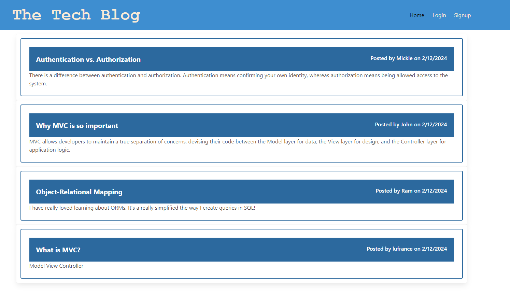

# Tech Blog CMS
This project is a CMS-style blog site built using the Model-View-Controller (MVC) paradigm. It allows developers to publish articles, blog posts, and opinions, as well as comment on other developers' posts.

## User Story
As a developer who writes about tech, I want a CMS-style blog site so that I can publish articles, blog posts, and my thoughts and opinions.

## Getting Started
To run the application locally, follow these steps:

1. Clone this repository to your local machine.
2. Navigate to the project directory in your terminal.
3. Install dependencies by running npm install.
4. Create a .env file in the root directory and add necessary environment variables.
5. Run the application using npm start.

## Technologies Used
- Express.js
- Handlebars.js
- Sequelize (MySQL2)
- Express-session
- Bcrypt

## Deployment
The application is deployed to Heroku and can be accessed at [\[Tech Blog\].](http://localhost:3001/)

## Repository Structure
- **controllers:** Contains the controller files for handling routing and business logic.
- **db:** Includes database configuration and model files.
- **models:** Defines Sequelize models for interacting with the database.
- **public:** Contains static assets such as CSS and client-side JavaScript files.
- **routes:** Defines route handlers for various endpoints.
- **views:** Contains Handlebars.js templates for rendering HTML.
- **config:** Stores configuration files, including environment variables.
- **utils:** Includes utility functions used throughout the application.

## Contributors
This project was created by [Your Name]. You can find the GitHub repository [here](https://github.com/lufranckousse).

